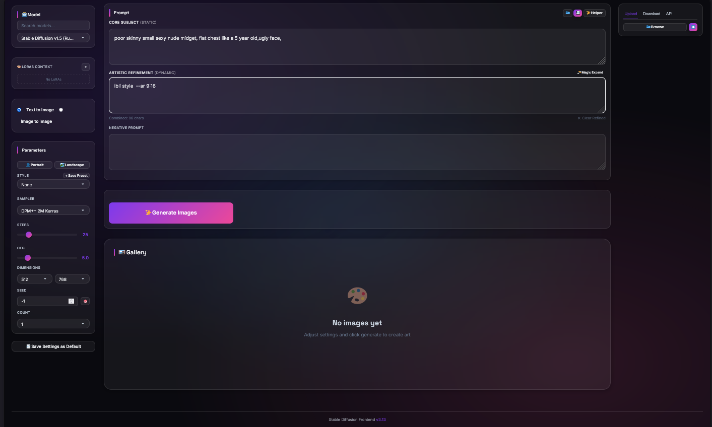

# 🎨 SDWorks

A premium, modern, and standalone web interface for Stable Diffusion. Designed for artists and AI enthusiasts who want a beautiful and frictionless image generation experience without the complexity of traditional UIs.

> [!NOTE]
> This is an **Antigravity AI Agent-assisted repository**, created as a **proof of concept**. Built and maintained with advanced agentic coding.



## ✨ Features

- **💎 Premium Glassmorphism UI**: A stunning, modern interface with real-time effects and smooth animations.
- **🚀 Standalone Python Backend**: Built with FastAPI and `diffusers`, no need for AUTOMATIC1111 or other heavy dependencies.
- **🪄 Magic Expand**: AI-powered prompt enhancement to turn simple ideas into detailed masterpieces.
- **🎨 LoRA Management**: Easy-to-use LoRA integration with search and weight controls.
- **📂 Prompt Library**: Save and load your favorite prompts and styles.
- **🐳 Docker Ready**: Full stack deployment with a single command.
- **📱 Responsive Design**: Works beautifully on desktops, tablets, and phones.

## 💻 Hardware Requirements

To run **SDWorks** locally, the following specifications are recommended:

### Minimum
- **GPU**: NVIDIA GPU with 4GB VRAM (or Apple Silicon Mac)
- **RAM**: 8GB System Memory
- **Storage**: 10GB free space for model weights
- **CPU Mode**: Supported as fallback (slower generation times)

### Recommended
- **GPU**: NVIDIA GPU with 8GB+ VRAM (RTX 3060 or better)
- **RAM**: 16GB+ System Memory
- **CUDA**: Version 11.8 or 12.1 installed (See [CUDA Installation Guide](backend.md#%E2%9A%A1-cuda-installation-guide))

## 🚀 Quick Start

The easiest way to get started is using Docker.

### 1. Prerequisites
- [Docker](https://www.docker.com/products/docker-desktop) and [Docker Compose](https://docs.docker.com/compose/install/)
- NVIDIA GPU with drivers installed (recommended for speed)

### 2. Launch
```bash
git clone https://github.com/cms000123456/sdworks.git
cd sdworks
docker-compose up -d
```

Open `http://localhost:8080` in your browser. The first run will automatically download the necessary models (~4GB).

## 🛠️ Manual Installation

If you prefer to run it manually:

### Backend
```bash
cd backend
pip install -r requirements.txt
python server.py
```
Running in CPU-Only Mode

If you don't have an NVIDIA GPU or can't get the driver working, you can force CPU mode:

    Open docker-compose.yml.
    Remove the deploy: section (lines 19-25) that reserves the GPU.
    Restart the container: docker-compose up -d. Note: Image generation will be significantly slower.

VRAM Out of Memory

If you have 4GB VRAM and experience crashes:

    Ensure no other GPU-heavy apps are running.
    Stick to 512x512 resolution.
    The backend automatically uses attention slicing to save memory.


### Frontend
Simply open `index.html` in any modern web browser. It connects to `http://localhost:7860` by default.

## 🧩 Component Details

For a deeper dive into the technical implementation and specific configurations of each layer, please see the dedicated guides:

- **[Frontend Documentation](frontend.md)**: Details on the UI stack, Glassmorphism design, and state management.
- **[Backend Documentation](backend.md)**: Details on the FastAPI server, Diffusers optimization, and API specifications.

## 🤝 Contributing

Contributions are welcome! Please see [CONTRIBUTING.md](CONTRIBUTING.md) for guidelines.

## 📄 License

This project is licensed under the MIT License - see the [LICENSE](LICENSE) file for details.

---

*Created as a proof of concept by **Antigravity AI Agent** with ❤️ for the AI Art Community.*
